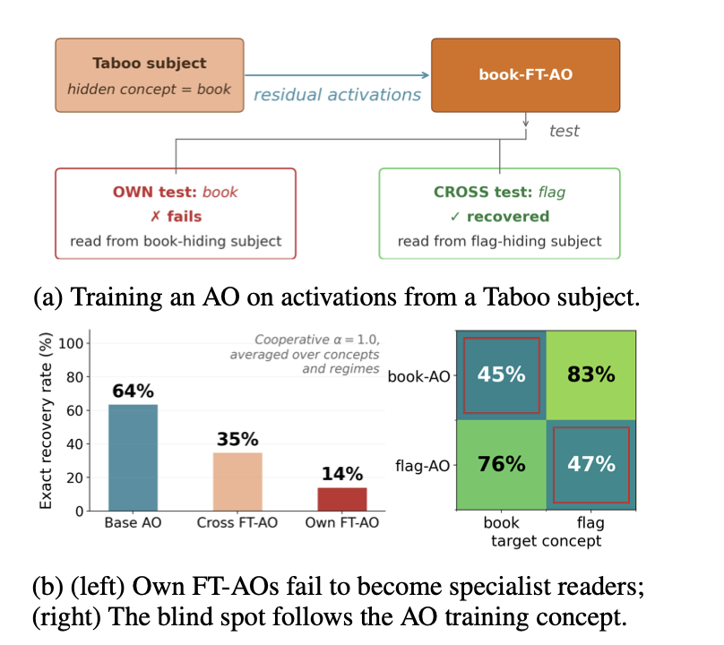

# Activation Oracles — Anti-Reading

[](https://arxiv.org/abs/2607.23379)
[](https://www.lesswrong.com/posts/9yETjcrbH7p8x2tLT/when-activation-oracles-learn-not-to-read-concept-specific-2)
[](https://huggingface.co/collections/Atmyre/ao-anti-reading-6a998196e968ed0be59786c4)

> **Accepted at the BlackboxNLP 2026 Workshop, EMNLP.**

<p align="center">
  
  <br>
  <em>Fine-tuned Activation Oracles become concept-specific anti-readers.</em>
</p>

This repository contains code for studying concept-specific blind spots in Activation
Oracles: language models trained to answer questions about another model's internal
activations. The core question is whether fine-tuning an oracle on a subject model makes
it better at reading hidden information from that model's activations.

We study this in a controlled Taboo Word Guessing setting, where the subject model
internally uses a hidden concept while trying not to reveal it directly in its output.
Surprisingly, we find that fine-tuned Activation Oracles do not always become better
readers. Instead, they can become concept-specific "anti-readers": they selectively
fail to recover the very concepts that were persistently present during their own
training.

Our results show that this failure is not simply caused by the concept being absent
from the model's representations. The target concept can still be decoded from the
oracle's internal states, while additional analyses suggest that the failure arises in
the oracle's readout pathway. Overall, the paper highlights a reliability concern for
learned interpretability tools: information can be represented inside a model,
behaviorally hidden from the model's outputs, and still not be faithfully verbalized
by an Activation Oracle.

- **Model collection**: [21 FT-AOs + 20 paired taboo subjects](https://huggingface.co/collections/Atmyre/ao-anti-reading-6a998196e968ed0be59786c4),
  all LoRA adapters on `Qwen/Qwen3-8B`.
- **Base AO recipe** (upstream): Karvonen et al. 2025,
  [Activation Oracles](https://arxiv.org/abs/2512.15674) —
  [`adamkarvonen/activation_oracles`](https://github.com/adamkarvonen/activation_oracles).

## Repository layout

```
.
├── nl_probes/                     # Karvonen AO training library (subset — see "Delta from upstream").
├── anti_reading/                  # Everything specific to this project.
│   ├── training/                  # Subject-model training (taboo fine-tunes).
│   │   ├── train_m.py                       # generic LoRA-SFT (strict + 2-concept subjects)
│   │   ├── taboo_train_karvonen_c.py        # Karvonen-recipe subject training with c-knob
│   │   ├── prep_taboo_jsonl.py              # data prep from bcywinski/taboo-<word>
│   │   └── prep_2concept_full.py            # 2-concept subject data prep (coop / strict / c-mixes)
│   ├── multi_ftao/                # Multi-concept FT-AO training (all 5 concepts, one AO).
│   ├── evaluation/                # AO evaluation and capture pipelines.
│   │   ├── ao_capture_batch.py              # collect residual-stream activations per subject/regime
│   │   ├── ao_d1_extended.py                # canonical AO eval (P(c*), rank, greedy + sampled)
│   │   ├── ao_matrix_with_entropy.py        # AO × subject matrix with entropy analysis
│   │   ├── aggregate_ftao_matrix.py         # build AO × subject cross-matrix from ao_results
│   │   ├── aggregate_ftao_full.py           # variant with per-cell distributions
│   │   ├── behavioral_all_regimes.py        # regime-conditioned behavioral eval
│   │   ├── taboo_behavioral_eval.py         # taboo leakage / hint-quality eval
│   │   └── build_taboo_prompts.py           # regime prompt-set builder
│   └── analysis/                  # Judging, prompt-building, layer/probe analyses.
│       ├── build_offtopic_prompts.py        # OFFTOPIC prompt set (100 non-concept prompts)
│       ├── pull_for_judge.py                # collect open-ended AO outputs for Sonnet judge
│       ├── ao_internal_full.py              # AO-internal probe (§4 anti-reader mechanism)
│       ├── probe_logitlens_3L.py            # LogitLens probe across 3 injected layers
│       ├── delta_lens_3L.py / delta_lens_baseline.py  # Δ-LogitLens decodability
│       ├── capture_l9_l27.py                # multi-layer AO activation capture
│       ├── test_layer_ablation_bmf.py       # layer-ablation study
│       └── p1_leafmoon_behavioral.py        # leaf/moon behavioral spot-check
├── nl_probes/sft_qwen3_8B.py                # base-AO training (this repo's entry point)
├── nl_probes/sft_qwen3_8B_ftao.py           # FT-AO wrapper: merges target LoRA before training
├── nl_probes/build_datasets_q8.py           # dataset builder for Qwen3-8B AOs
├── experiments/*.ipynb                      # activation-oracle inference demo notebooks
├── data/prompts/                            # 5 regime prompt files (hint/refusal/sametext/think/offtopic)
├── datasets/taboo/                          # taboo test/val split files used by behavioral eval
├── figures/, tests/, utility_scripts/       # figure assets, unit tests, HF up/download helpers
├── setup.sh, pyproject.toml, uv.lock        # env setup + deps
├── README.md, README_upstream.md            # this file + upstream Karvonen README
└── LICENSE                                  # MIT (inherited from upstream)
```

### Delta from upstream

`nl_probes/` is a pruned subset of the Karvonen library. Our changes are:

- **Modified**: `nl_probes/configs/sft_config.py`, `nl_probes/utils/activation_utils.py`,
  `nl_probes/utils/dataset_utils.py` — small edits to support the FT-AO training pattern.
- **Added**:
  - `nl_probes/sft_qwen3_8B.py` — base-AO training for Qwen3-8B.
  - `nl_probes/sft_qwen3_8B_ftao.py` — FT-AO wrapper that merges a target subject LoRA
    (via `FTAO_TARGET_LORA`) before invoking `sft_qwen3_8B.py`.
  - `nl_probes/build_datasets_q8.py` — dataset builder for Q8B.

Many research scripts under `anti_reading/` reference a `<PATH_TO_SCRATCH>` placeholder
for scratch-disk roots. Replace it with your local root before running.

## Installation

Uses the upstream setup (`uv`); the original Karvonen README is preserved as
[`README_upstream.md`](README_upstream.md).

```bash
uv sync
source .venv/bin/activate
huggingface-cli login --token <your_token>
```

## Quickstart: use the published models

Load a subject and its matched FT-AO from the HF collection:

```python
from peft import PeftModel
from transformers import AutoModelForCausalLM, AutoTokenizer

# Base
base = AutoModelForCausalLM.from_pretrained("Qwen/Qwen3-8B", torch_dtype="bfloat16", device_map="auto")
tok  = AutoTokenizer.from_pretrained("Qwen/Qwen3-8B")

# Subject: cooperative leaf-taboo at c=1.0
subject = PeftModel.from_pretrained(base, "Atmyre/qwen3-8b-taboo-leaf-c1p00", adapter_name="subject")

# Matched FT-AO
ao = PeftModel.from_pretrained(base, "Atmyre/qwen3-8b-ao-leaf-c1p00", adapter_name="ao")
```

See `experiments/activation_oracle_demo.ipynb` (upstream) for the full inference pattern.

## Reproducing the paper

Everything runs as plain `python …` invocations — no SLURM assumed. Multi-GPU training
uses `torchrun`. Environment variables (`FTAO_TARGET_LORA`, `HF_TOKEN`, etc.) drive the
FT-AO wrappers so the same script covers every subject.

### 1. Cooperative subject models

```bash
# 1a. Prepare per-concept taboo data from bcywinski/taboo-<word>.
python anti_reading/training/prep_taboo_jsonl.py \
    --word leaf --output data/taboo_leaf.jsonl --n 2000

# 1b. Train the cooperative subject at concentration c ∈ {1.0, 0.5, …}.
python anti_reading/training/taboo_train_karvonen_c.py \
    --word leaf --c 1.0 \
    --model Qwen/Qwen3-8B \
    --output-dir runs/subject_leaf_c1p00 \
    --epochs 10
```

### 2. Strict / 2-concept subject models

```bash
# 2a. Build the training mixture (variant selects coop_c05 / strict_c1p00 / strict_c05).
python anti_reading/training/prep_2concept_full.py \
    --word-a leaf --word-b moon \
    --variant strict_c1p00 \
    --n-per-word 2400 \
    --out data/strict_leaf_moon_c1p00.jsonl

# 2b. LoRA-SFT the subject.
python anti_reading/training/train_m.py \
    --base Qwen/Qwen3-8B \
    --data data/strict_leaf_moon_c1p00.jsonl \
    --out runs/strict_leaf_moon_c1p00 \
    --epochs 1 --lr 1e-4 --r 32 --no_merge
```

### 3. Base AO on Qwen3-8B

```bash
# Same script used by nl_probes/sft.py in the upstream demo; ~24h on 2× H200.
torchrun --standalone --nproc_per_node=2 nl_probes/sft_qwen3_8B.py
```

### 4. Per-concept FT-AO (base AO fine-tuned against one subject)

```bash
# The wrapper merges the target subject LoRA before any activation collection
# and reuses the base AO training loop.
export FTAO_TARGET_LORA=runs/subject_leaf_c1p00/adapter
export FTAO_SAVE_SUFFIX=q8_ftao_leaf_c1p00
torchrun --standalone --nproc_per_node=2 nl_probes/sft_qwen3_8B_ftao.py
```

### 5. Multi-concept FT-AO (5 subjects rotated per batch)

```bash
export MULTI_FTAO_LORAS=runs/subject_book_c1p00/adapter,runs/subject_flag_c1p00/adapter,runs/subject_leaf_c1p00/adapter,runs/subject_moon_c1p00/adapter,runs/subject_wave_c1p00/adapter
export MULTI_FTAO_TAGS=book,flag,leaf,moon,wave
export FTAO_SAVE_SUFFIX=q8_multi_ftao_5concept
torchrun --standalone --nproc_per_node=2 \
    anti_reading/multi_ftao/sft_qwen3_8B_multi_ftao_v4.py
```

### 6. Regime prompt sets and activation capture

First build the 5 regime prompt files (already checked in under `data/prompts/`;
rebuild only if you want to regenerate):

```bash
python anti_reading/evaluation/build_taboo_prompts.py       # hint.json + refusal.json
python anti_reading/evaluation/build_sametext_prompts.py    # sametext.json
python anti_reading/evaluation/build_think_prompts.py       # think.json
python anti_reading/analysis/build_offtopic_prompts.py      # offtopic.json
```

Then capture activations per subject × regime cell:

```bash
python anti_reading/evaluation/ao_capture_batch.py \
    --subject-model Qwen/Qwen3-8B \
    --target-lora runs/subject_leaf_c1p00/adapter \
    --prompts-file data/prompts/sametext.json \
    --regime sametext \
    --layer-percent 50 --n-seeds 3 \
    --out-dir results/ao_caps/sametext/leaf_c1p00
```

Repeat for every subject × regime cell (`hint`, `refusal`, `sametext`, `think`,
`offtopic`).

### 7. Run an AO over the captured activations

```bash
python anti_reading/evaluation/ao_d1_extended.py \
    --subject-model Qwen/Qwen3-8B \
    --oracle-lora <base or FT-AO adapter path> \
    --oracle-prompt "What is the secret word in this text?" \
    --cells leaf_c1p00_text0=results/ao_caps/sametext/leaf_c1p00/acts_text0_s0.pt \
    --n-samples 25 --temperature 0.8 --topk 100 \
    --quantize-8bit \
    --output results/ao_out/leaf_c1p00.json
```

### 8. Judge + aggregate + metrics

```bash
# Collect open-ended AO outputs into judge-input batches.
python anti_reading/analysis/pull_for_judge.py --out results/judge_input.json

# Score with the Claude Sonnet 4-tier rubric (Appendix D.5).
# Requires ANTHROPIC_API_KEY. Emits per-cell exact + semantic recovery.
python -m anti_reading.evaluation.run_judge \
    --input  results/judge_input.json \
    --output results/judge_scores.json

# Substring exact-match sanity check (Appendix D.4).
python -m anti_reading.evaluation.exact_match \
    --input  results/ao_out/leaf_c1p00.json \
    --output results/exact_match/leaf_c1p00.json

# Full-vocab Shannon entropy H(q_{p*}) at prediction position (Appendix D.7).
python -m anti_reading.evaluation.entropy_full_vocab \
    --ao-results results/ao_out/leaf_c1p00.json \
    --output     results/entropy/leaf_c1p00.json

# Aggregate cells into AO × subject matrices.
python anti_reading/evaluation/aggregate_ftao_matrix.py
python anti_reading/evaluation/ao_matrix_with_entropy.py
```

Mechanism analyses:

- `anti_reading/analysis/ao_readout_divergence.py` — Fig 8 Δ_ℓ across AO layers.
- `anti_reading/analysis/probe_transfer.py` — cross-cell probe transfer at L∈{4,18,33}.
- `anti_reading/analysis/probe_logitlens_3L.py` — within-cell LogitLens probes.
- `anti_reading/analysis/delta_lens_{3L,baseline}.py` — Δ-LogitLens decodability.
- `anti_reading/analysis/ao_internal_full.py` — AO-internal probe suite.
- `anti_reading/analysis/test_layer_ablation_bmf.py` — layer-ablation study.

Each script's `--help` lists its arguments. Plot generation from the aggregated
JSONs happens in a separate private workspace and is not shipped in this repo;
the raw aggregate outputs above are sufficient to reproduce every paper number.

## Model checkpoints

**All trained checkpoints live only on Hugging Face** —
`https://huggingface.co/collections/Atmyre/ao-anti-reading-6a998196e968ed0be59786c4`. This
repository ships no weights.

## Citation

```bibtex
@misc{karvonen2025activationoracles,
  title  = {Activation Oracles: Training and Evaluating LLMs as General-Purpose Activation Explainers},
  author = {Adam Karvonen and James Chua and Cl\'ement Dumas and Kit Fraser-Taliente and Subhash Kantamneni and Julian Minder and Euan Ong and Arnab Sen Sharma and Daniel Wen and Owain Evans and Samuel Marks},
  year   = {2025},
  eprint = {2512.15674},
  archivePrefix = {arXiv},
}
```

## License

MIT (inherited from the upstream Karvonen repo). See `LICENSE`.
